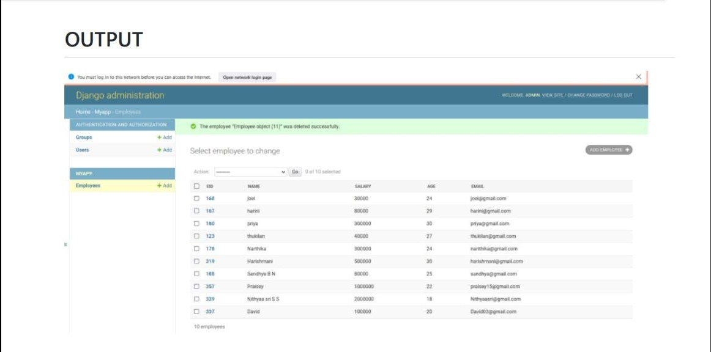

# Django ORM Web Application

## AIM
To develop a Django application to store and retrieve data from a database using Object Relational Mapping(ORM).

## Entity Relationship Diagram

Include your ER diagram here

## DESIGN STEPS

### STEP 1:
create the django domain
### STEP 2:
then from the the django.db import the models and then from the django.contribute import
the admin
### STEP 3:
then create your own model by defining the class and with the respective comments

## PROGRAM
Model.py 
from django.db import models 
from django.contrib import admin 
class Employee(models.Model): 
eid=models.CharField(max_length=20,help_text="Employee ID") 
name=models.CharField(max_length=100) 
salary=models.IntegerField() 
age=models.IntegerField() 
email=models.EmailField()
class EmployeeAdmin(admin.ModelAdmin): 
list_display=('eid','name','salary','age','email') 
Admin.py 
from django.contrib import admin 
from.models import Employee,EmployeeAdmin 
admin.site.register(Employee, EmployeeAdmin)

## OUTPUT

## RESULT
program is excuted